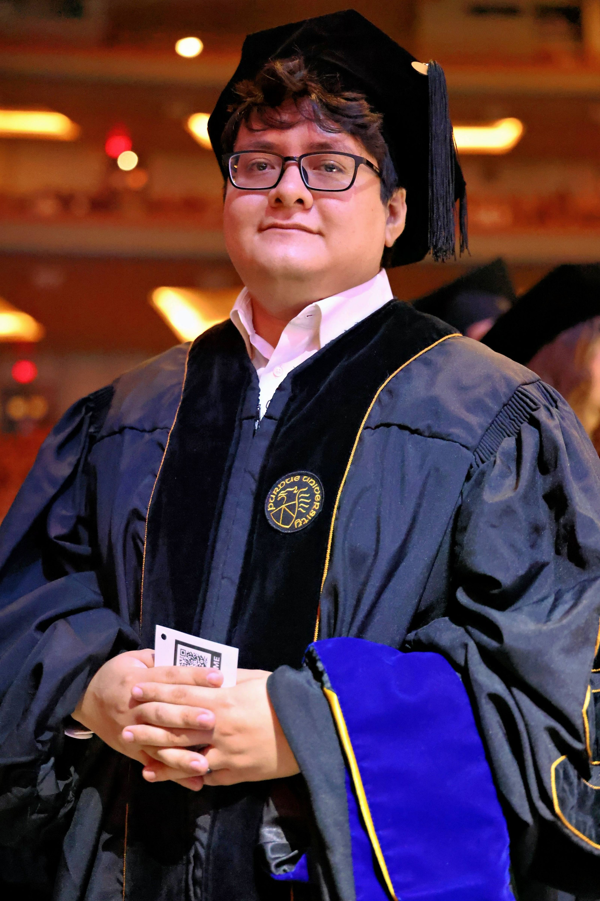

::: {.hero-grid .about-hero}
::: {.hero-copy}

Background

I was born in Ecatepec de Morelos, Mexico, and moved to the United States at the age of four. Growing up as a first-generation immigrant and Dreamer shaped both my perspective and my commitment to mathematics and education.

I began my higher education at Lone Star College--North Harris, where I earned an Associate of Science degree in 2016. I then studied mathematics at the University of Houston, completing a Bachelor of Science degree in 2019 and discovering my interest in number theory. I completed my PhD in mathematics at Purdue University in spring 2026 under the supervision of Trevor Wooley, developing my research program in analytic number theory and the Hardy--Littlewood circle method. I am currently a G. C. Evans Instructor in the Department of Mathematics at Rice University.

For a longer account of this path, see my essay ["What I Needed to Hear Ten Years Ago: A Dreamer's Journey in Math"](https://maa.org/math-values/what-i-needed-to-hear-ten-years-ago-a-dreamers-journey-in-math/) for the Mathematical Association of America.
:::

::: {.hero-photo}
{fig-alt="Daniel Flores Galiote in academic regalia"}
:::
:::

## Beyond mathematics

Outside mathematics, I value time with my wife and son. We enjoy playing video games together. I also play trumpet, an activity that provides both a creative outlet and a welcome challenge away from research.

## Academic links

- [Curriculum vitae](CV_DF.pdf)
- [GitHub](https://github.com/DanielFloresMath)
- [ORCID](https://orcid.org/0009-0003-7623-2959)
- [Email](mailto:df66@rice.edu)
