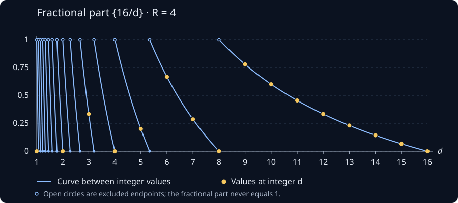

[All notes](../notes.qmd)

*Recommended prerequisites: basic divisibility, infinite series (especially alternating series), and limits.*

Here $\chi$ is the character modulo $4$ given by

$$
\chi(d)=
\begin{cases}
0,&d\equiv0,2\pmod4,\\
1,&d\equiv1\pmod4,\\
-1,&d\equiv3\pmod4.
\end{cases}
$$

Near the end of the video titled [“Pi hiding in prime regularities”](https://www.youtube.com/watch?v=NaL_Cb42WyY), Grant gets to the point in which he wants to state that

$$
\begin{aligned}
\sum_{1\leq n\leq R^2}\sum_{d\mid n}\chi(d)
&\sim R^2\sum_{d=1}^{\infty}\frac{\chi(d)}{d}\\
&=R^2\left(1-1/3+1/5-1/7+\cdots\right).
\end{aligned}
$$

Here we are letting $R\to\infty$, and $\sim$ means that the ratio of the two sides tends to $1$. All the sums below are over positive integers unless stated otherwise.

He does this by doing a visual representation of a standard trick you use when dealing with sums of sums over divisors. Every pair $n,d$ with $d\mid n$ can be written uniquely as $n=d\ell$. So instead of fixing $n$ and looking at its divisors, we can fix $d$ and count its multiples up to $R^2$. This gives

$$
\begin{aligned}
\sum_{1\leq n\leq R^2}\sum_{d\mid n}\chi(d)
&=\sum_{1\leq d\leq R^2}\sum_{1\leq \ell\leq R^2/d}\chi(d)\\
&=\sum_{1\leq d\leq R^2}\chi(d)\sum_{1\leq \ell\leq R^2/d}1\\
&=\sum_{1\leq d\leq R^2}\chi(d)\left\lfloor\frac{R^2}{d}\right\rfloor.
\end{aligned}
$$

It is here that he pulls a fast one and simply states that

$$
\sum_{1\leq d\leq R^2}\chi(d)\left\lfloor\frac{R^2}{d}\right\rfloor
\sim R^2\sum_{d=1}^{\infty}\frac{\chi(d)}{d}.
$$

While this seems innocent enough, it is however possible that the errors add up and bite you in the butt when you do this. So I went ahead and tried to justify this claim (It was surprisingly tricky to show). First we write $\left\lfloor\frac{R^2}{d}\right\rfloor=\frac{R^2}{d}-\left\{\frac{R^2}{d}\right\}$ (Here $\{x\}$ denotes the fractional part of a real number $x$), then we see that

$$
\begin{aligned}
\sum_{d\leq R^2}\chi(d)\left\lfloor\frac{R^2}{d}\right\rfloor
&=R^2\sum_{d\leq R^2}\frac{\chi(d)}{d}
-\sum_{d\leq R^2}\chi(d)\left\{\frac{R^2}{d}\right\}\\
&=R^2\sum_{d=1}^{\infty}\frac{\chi(d)}{d}
-R^2\sum_{d>R^2}\frac{\chi(d)}{d}
-\sum_{d\leq R^2}\chi(d)\left\{\frac{R^2}{d}\right\}.
\end{aligned}
$$

Note that in order to prove the claim Grant made in the video (The main term is expected to be a constant times $R^2$) it is enough to show that

$$
R^2\sum_{d>R^2}\frac{\chi(d)}{d}
+\sum_{1\leq d\leq R^2}\chi(d)\left\{\frac{R^2}{d}\right\}
=o(R^2).
$$

The notation $o(R^2)$ just means that the error divided by $R^2$ tends to zero. So we don't need the error itself to be small, we just need it to be small compared with $R^2$.

We may easily take care of the left hand sum. After removing the zero terms, $\sum_{d>R^2}\frac{\chi(d)}{d}$ is the tail of an alternating series whose term magnitudes decrease to zero. The decreasing part matters here: just knowing that the individual terms are small would not be enough. By the [alternating series estimation theorem](https://en.wikipedia.org/wiki/Alternating_series_test#Alternating_series_estimation_theorem), the absolute value of this tail is at most the first term in magnitude. Thus

$$
\left|R^2\sum_{d>R^2}\frac{\chi(d)}{d}\right|
< R^2\cdot\frac{1}{R^2}=1.
$$

Now comes the slightly tricky part, bounding the other sum. If we just take absolute values term by term, we get a bound of $R^2$, which is exactly the size we are trying to improve on. We need to use some cancellation from $\chi(d)$.

The problem is that $\{R^2/d\}$ keeps jumping, so it is not decreasing over the whole sum. But between two consecutive jumps it does decrease nicely. Here is what this looks like when $R=4$. The sum only uses integer values of $d$ (the gold dots), but letting $d$ vary continuously makes the jumps easier to see.

{#fig-fractional-part width=900 fig-alt="Graph of the fractional part of 16/d from d=1 to d=16. Blue curves decrease between jumps at d=16/m; gold dots mark the integer inputs used in the sum. Open circles at height one are excluded."}

So let's split the sum into intervals on which $\lfloor R^2/d\rfloor$ is constant. In particular,

$$
\frac{R^2}{m+1}<d\leq\frac{R^2}{m}
\quad\Longleftrightarrow\quad
m\leq\frac{R^2}{d}<m+1.
$$

On this interval the floor is $m$, and hence $\{R^2/d\}=R^2/d-m$. Let $K>1$ be an integer. We leave the terms with $d\leq R^2/K$ alone for now and split up the rest as such:

$$
\begin{aligned}
\sum_{d\leq R^2}\chi(d)\left\{\frac{R^2}{d}\right\}
&=\sum_{d\leq R^2/K}\chi(d)\left\{\frac{R^2}{d}\right\}
+\sum_{m=1}^{K-1}\left(
\sum_{R^2/(m+1)<d\leq R^2/m}\chi(d)\left\{\frac{R^2}{d}\right\}
\right).
\end{aligned}
$$

Feel free to take some time to justify to yourself that the sum on the left hand side is in fact equal to the sum on the right hand side, this is definitely not obvious at first glance. The intervals for $m=1,\ldots,K-1$ fit together to cover exactly $R^2/K<d\leq R^2$, with no gaps or overlaps. Now why did I make this sum look so much worse? Well note that

$$
\left|\sum_{R^2/(m+1)<d\leq R^2/m}\chi(d)\left\{\frac{R^2}{d}\right\}\right|\leq1
$$

because, after omitting the even $d$, the signs of $\chi(d)$ alternate, and the magnitudes $R^2/d-m$ decrease as $d$ increases. They are all between $0$ and $1$, so this finite alternating sum has absolute value at most $1$, regardless of whether its first nonzero term is positive or negative. There are $K-1$ such intervals, so the triangle inequality gives

$$
\left|\sum_{m=1}^{K-1}\left(
\sum_{R^2/(m+1)<d\leq R^2/m}\chi(d)\left\{\frac{R^2}{d}\right\}
\right)\right|\leq K-1\leq K.
$$

For the terms we left alone, we have at most $R^2/K$ terms, each of absolute value at most $1$. So here the trivial bound is enough:

$$
\left|\sum_{1\leq d\leq R^2/K}\chi(d)\left\{\frac{R^2}{d}\right\}\right|
\leq\frac{R^2}{K}.
$$

Combining these two bounds we have

$$
\left|\sum_{1\leq d\leq R^2}\chi(d)\left\{\frac{R^2}{d}\right\}\right|
\leq\frac{R^2}{K}+K.
$$

Now we get to choose $K$. Making it bigger improves the first term but makes the second one worse, so let's balance them by taking $K=\lceil R\rceil$ for $R>1$. Since $R\leq K<R+1$, we get

$$
\left|\sum_{d\leq R^2}\chi(d)\left\{\frac{R^2}{d}\right\}\right|
\leq\frac{R^2}{\lceil R\rceil}+\lceil R\rceil
\leq 2R+1.
$$

Together with the bound of $1$ for the series tail, the total error is at most $2R+2$. Dividing this by $R^2$ gives something tending to zero, which is exactly what we wanted. In fact, we have shown a little more:

$$
\sum_{n\leq R^2}\sum_{d\mid n}\chi(d)
=R^2\sum_{d=1}^{\infty}\frac{\chi(d)}{d}+O(R).
$$

Here $O(R)$ means that the absolute value of the error is bounded by a constant times $R$ for all sufficiently large $R$. So the statement Grant made is in fact correct (of course), however it is not as trivial to prove as one might assume at first.
